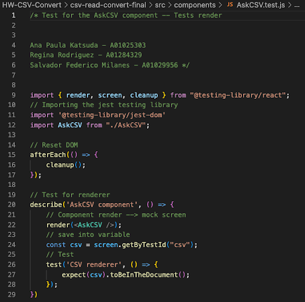
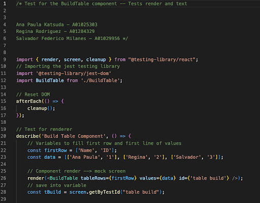
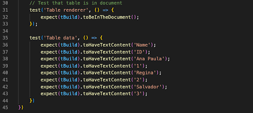
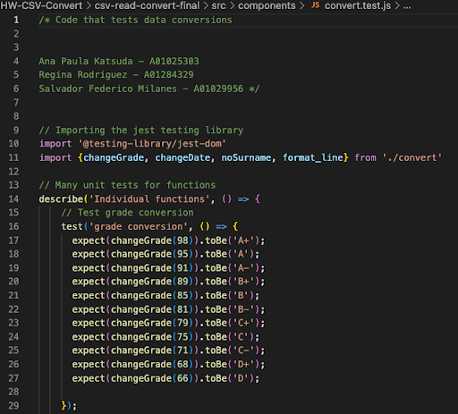
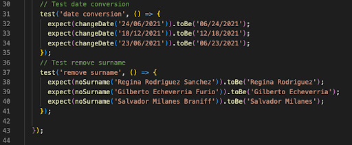
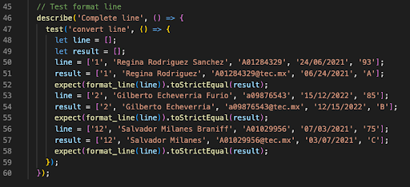
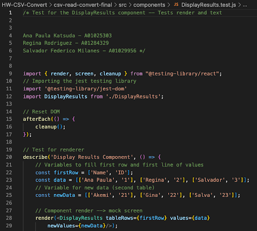
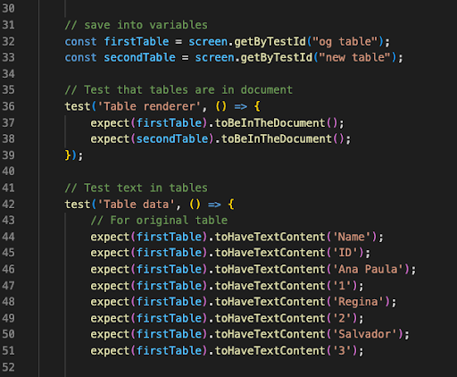
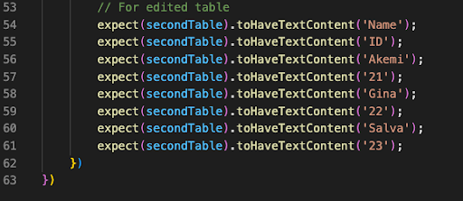
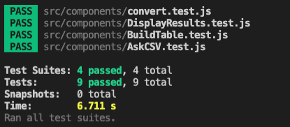

## Reporte Pruebas de Software 

Presentan:
Ana Paula Katsuda - A01025303
Regina Rodríguez Sánchez - A01284329
Salvador Federico Milanés Braniff - A01029956

## Introducción
Las pruebas de software se utilizan para poder evaluar y verificar que un producto o aplicación de software funcione adecuadamente. Estas pruebas se pueden hacer a través de distintos procesos y técnicas, que, dependiendo de las necesidades particulares del software se utilizan. Además, las pruebas son beneficiosas para prevenir errores, reducir el costo de desarrollo y mejorar el rendimiento (IBM, s.f.). Con lo anterior en mente, el objetivo del presente escrito, es profundizar los tipos de pruebas existentes, las herramientas utilizadas para estas y aplicar dichas pruebas. 
En cuanto a los tipos de pruebas, existen múltiples y tienen propósitos distintos. En términos generales, existen las pruebas funcionales  y las no funcionales. Haciendo referencia a las pruebas funcionales, estas tienen el propósito de garantizar que se cumplan los comportamientos del software y para comprobar las características críticas del mismo. Por otro lado, las pruebas no funcionales se relacionan con seguridad, confiabilidad y elementos que no tienen que ver con la funcionalidad del software en sí. A continuación, se explican con mayor detalle algunas de las pruebas existentes: 
- Pruebas locales: O unitarias; se enfocan en validar el comportamiento de un componente en particular de forma independiente. De esta manera, el código invoca individualmente un bloque en el sistema y revisa una “asumpción” sobre el comportamiento esperado (Munot, K., 2019).
- Pruebas de integración: Las pruebas de integración verifican el funcionamiento en conjunto de los distintos módulos o servicios presentes en la app. Por ejemplo, puede probarse la interacción con la base de datos. Las pruebas de integración pueden ser costosas al depender de varias partes de la aplicación en funcionamiento. (IBM, s. f.)
- Pruebas alfa: Pruebas iniciales para validar el funcionamiento de una aplicación; se llevan a cabo al principio del proceso de desarrollo y son seguidas con pruebas beta. (Pruebas alfa, 2022)
- Pruebas de regresión: Pruebas para averiguar si una aplicación en forma aún funciona como se esperaba tras haber sido actualizada o alterada. Es vital hacerlas cada vez que el código se modifica. (Singh, K. 2022)
- Pruebas dinámicas de validación: Pruebas que analizan el comportamiento dinámico del código. Para realizarlas, el software debe compilarse y ejecutarse. Se analizan parámetros como el uso de memoria, CPU; el tiempo de respuesta; y el rendimiento general del software.
El software se prueba mediante los valores de entrada y se analizan los valores de salida. (IBM, s. f.)
- Pruebas bajo condiciones frontera: Consisten en probar un componente cuya estructura está basada en condiciones de un tipo de dato particular, un rango determinado, una extensión en dígitos o caracteres, etcétera; Validando que el software filtre adecuadamente los datos válidos como parte del funcionamiento (es decir, sin obstruirse), y/o que tenga un comportamiento determinado en caso de recibir un dato que no cumple con las condiciones definidas.  (Ramirez. C, 2022)

## Herramientas de Pruebas de Software

## Caso de Prueba
Para fines del presente escrito, se decidió utilizar Jest para realizar pruebas a una aplicación que lee, convierte y muestra datos de un ‘csv’ en forma de tabla. Se hicieron pruebas unitarias de cada uno de los componentes que conforman la aplicación como se muestra a continuación:
 ### Archivos de prueba

 #### AskCSV.test.js

#### BuildTable.test.js

#### convert.test.js

#### DisplayResults.test.js

#### Tests passed

## Convertidor CSV
La aplicación acepta un archivo CSV con datos de estudiantes, los muestra en una tabla, y convierte algunos de los valores. 

Es posible correr dicha aplicación accediendo a la carpeta 'csv-read-convert-final' y corriendo la siguiente línea:  
  > npm start

Para correr las pruebas de los distintos componentes: 
  > npm test

Un posible 'input' para el csv dentro de la aplicación puede ser encontrado en este folder bajo el nombre 'students_mex.csv'.

## Fuentes
- Everett, G., McLeod, R. (2007). Software testing. Recuperado el 23 de agosto, de http://worldcolleges.info/sites/default/files/software-testing-testing-across-the-entire-software-development-life-cycle.9780471793717.28214.pdf
- Getting Started · Jest. (2022).  Recuperado el 24 de agosto, de https://jestjs.io/docs/getting-started
- GitHub - google/EarlGrey: iOS UI Automation Test Framework. (2022). Recuperado el 24 de agosto, de https://github.com/google/EarlGrey
- Herramientas de Desarrollo de Software | Software de Desarrollo. (2022). Recuperado el 25 de Agosto, de https://okhosting.com/blog/herramientas-de-desarrollo-de-software/
- Introduction | WebdriverIO. (2022). Recuperado el 24 de agosto, de: https://webdriver.io/docs/api/  
- Munot, K. (2019). Unit-testing important role in software development. Recuperado el 25 de agosto, de https://medium.com/nonstopio/unit-testing-important-role-in-software-development-1
f52f7c810f8
- Prueba alfa. (2022). Recuperado el 24 de Agosto, de https://isolution.pro/es/t/software-testing-dictionary/alpha-testing/prueba-alfa
- ¿Qué es la prueba de software y Cómo Funciona? IBM. (s.f.). Recuperado el 23 de agosto de  https://www.ibm.com/mx-es/topics/software-testing
- Ramirez. C (2022). ¿Qué es el Análisis del Valor Límite (BVA) de la Técnica de Pruebas de Caja Negra? | . Recuperado el 25 de Agosto, de https://ca-ra.org/es/an%C3%A1lisis-del-valor-l%C3%ADmite-una-t%C3%A9cnica-de-pruebas-de-caja-negra/
- Robot Framework documentation. (2022). Recuperado el 24 de Agosto, de https://robotframework.org/robotframework/
- The Selenium Browser Automation Project. (2022). Recuperado el 24 de agosto, de https://www.selenium.dev/documentation/
- Singh, K. (2022). Pruebas de regresión: todo lo que necesita saber. Recuperado el 24 de agosto, de https://geekflare.com/es/regression-testing-tools/
- Turrado, J. (2020). Qué son las pruebas de software - campusMVP.es. Recuperado el 23 de agosto, de: https://www.campusmvp.es/recursos/post/que-son-las-pruebas-de-software.aspx
- Why Cypress? | Cypress Documentation. (2022). Recuperado del 23 de agosto, de https://docs.cypress.io/guides/overview/why-cypress
